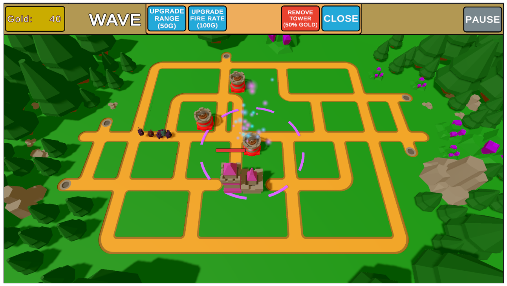
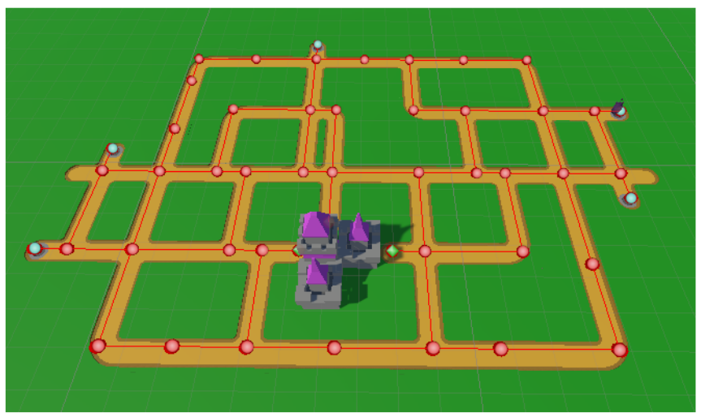
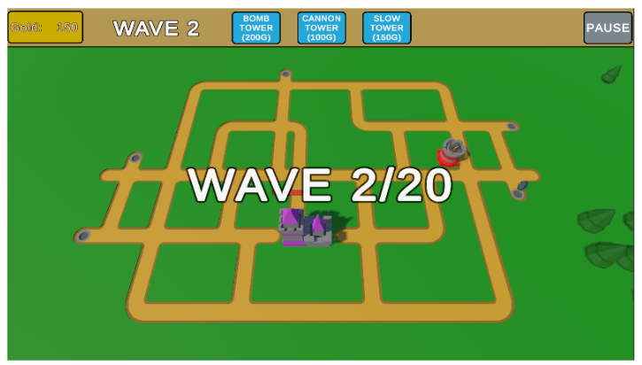
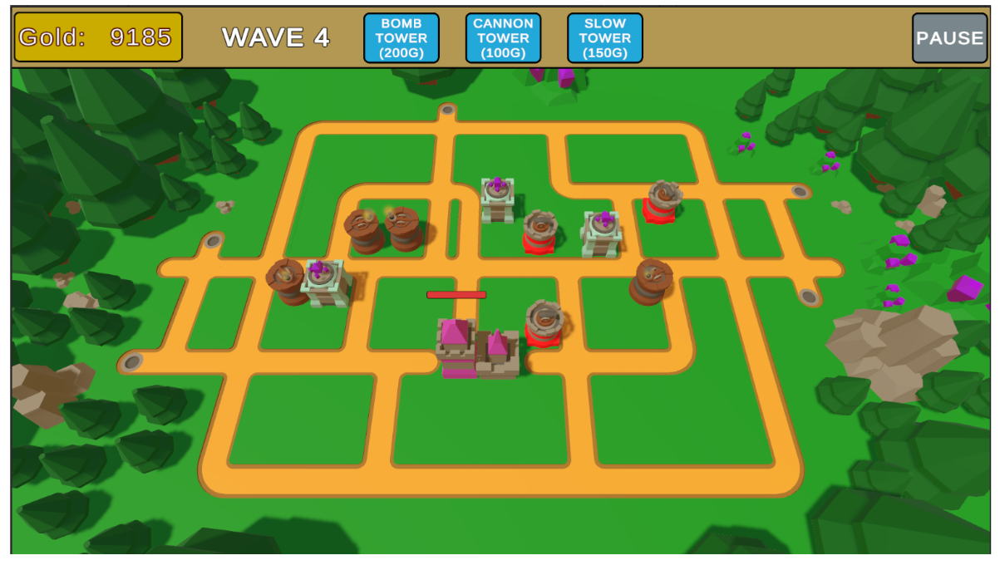

# Exploración de la integración de IA en Unity a través del desarrollo de videojuegos 🎮

**Autor:** Oier Álvarez Parada  
**Fecha:** Febrero 2025  
**Tutorizado por:** Iñigo López Gazpio & Igor Rodríguez  

---

## 🧠 Descripción

Este proyecto corresponde al **Trabajo de Fin de Grado en Ingeniería Informática**, y tiene como objetivo **explorar la capacidad de integración de la Inteligencia Artificial (IA) en el desarrollo de videojuegos con Unity**.  

Para ello, se ha desarrollado un **videojuego tipo Tower Defense** como prototipo, integrando diferentes algoritmos de IA tradicionales (como *A* y versiones mejoradas*) y evaluando el uso de **IA generativa** para la creación de assets 3D mediante herramientas como *StableFast3D* y *Blender*, además de pruebas en entornos de **realidad virtual**.

---

## 🎮 Características del videojuego

- Juego de estrategia tipo **Tower Defense** desarrollado en **Unity (C#)**.  
- Implementación de **IA de búsqueda de caminos** (*pathfinding*) usando:
  - Algoritmo aleatorio
  - Algoritmo A*
  - Versión mejorada de A*
- Sistema de **dificultad dinámica**, donde los enemigos cambian su comportamiento en tiempo real.
- Evaluación de **assets generados por IA generativa** (StableFast3D + Blender + VR).
- Sistema de **economía, oleadas de enemigos, HUD y UI** totalmente funcional.

---

## 🧩 Tecnologías utilizadas

- **Unity** – Motor de desarrollo principal  
- **C#** – Lenguaje de programación  
- **Blender** – Modelado y análisis de assets 3D  
- **StableFast3D** – IA generativa para creación de modelos 3D  
- **SteamVR / OpenXR / ALVR** – Integración con realidad virtual  
- **Git & GitHub** – Control de versiones  

---

## 📸 Capturas del juego

